<div style="background-color:white; color:black">

<h3 align="center">Talleres y Seminarios de Tecnologías Emergentes I</h3>


<h1 align="center">Introducción a <b>Git</b> y <b>GitHub</b></h1>


<h2 align="center">Práctica 1</h2>

<h3 align="center">Grado en Tecnología Digital y Multimedia</h3>
<h4 align="center">F. J. Martínez Zaldívar</h3>
<h4 align="center">Depto. de Comunicaciones</h4>
<h3 align="center">ETSIT-UPV</h3>


# 1. Introducción y objetivos

En la presente práctica del "Taller Seminario de Tecnologías Emergentes I" vamos a intentar adquirir una mínima destreza con algunas herramientas pertenecientes al contexto de programación, que nos van a permitir realizar un control de versiones de nuestro software o nuestro proyecto en general.  

Nuestro proyecto estará ubicado bajo cierto _directorio de trabajo_ el cual deseamos **versionar**, lo cual interpretaremos como el hecho de guardar distintas versiones del contenido  de dicho directorio que ha ido evolucionando con el tiempo (y en el _espacio_). Toda la información necesaria para recuperar cualquiera de estas versiones estará alojada en una ubicación   dentro del propio directorio de trabajo, denominada _repositorio_; es decir, el directorio de trabajo contendrá al repositorio que contiene su evolución. En este contexto, diremos que el directorio está _versionado_ y a veces, abusando del lenguaje, confundiremos repositorio con directorio versionado, aunque en princpio son conceptos distintos, pero que con la experienca deberíamos ser capaces tanto de mezclar como de distinguir.


Para ello vamos a trabajar con __Git__ y __GitHub__. __Git__ es el nombre del software que nos permitirá realizar el control de versiones de un proyecto en nuestra máquina; __GitHub__ es un sitio web que nos proporcionará toda la infraestructura necesaria para alojar, compartir y gestionar en la nube el repositorio correspondiente a nuestro proeycto versionado. Adicionalmente realizaremos algunos ejercicios sencillos relacionados con la denominada _ventana de línea de comandos_ para aprender a interactuar cómodamente con __Git__ y oportunamente con __GitHub__. 


Los objetivos que nos planteamos para la presente práctica son:
- Conseguir una mínima habilidad en el manejo de la ventana de línea de comandos
- Tener una versión operativa de __Git__ instalada en la máquina de trabajo realizando una configuración mínima pero suficiente de este software
- Realizar una primera clonación de prueba de un repositorio **remoto público** alojado en __GitHub__
- Realizar el registro en __GitHub__ de una cuenta personal para disponer de acceso a repositorios remotos **públicos** o **privados**, _clonarlos_, adherirse a una _organización_, etc.


## 1.1. Realización de la práctica

Esta práctica es individual y se sugiere que tras una primera lectura, con la que el alumno puede hacerse una composición de lugar general de la realización de la misma, se vuelva al principio de la misma y se vayan siguiendo los pasos que se van enumerando. 

**Importante**: a lo largo de la memoria irán apareciendo algunas cuestiones con epígrafes como __Ejercicio__ o expresiones similares,  cuyas respuestas se deben ir almacenando en un fichero de texto plano que formará parte de la documentación a entregar como resultado de la realización de la práctica. 
En el transcurso de la práctica se clonará un repositorio remoto privado y compartido con la _organización_ de la asignatura, donde se guardará finalmente el fichero de resultados citado anteriormente y de esa forma se realizará la entrega efectiva de la práctica. 

En el contexto de __GitHub__, una _organización_ es un conjunto de repositorios pertenecientes a una serie de usuarios _miembros_ de la organización y una serie de criterios que rigen las características de los repositorios y la relación con los miembros. El nombre de _nuestra_ organización, que aglutina tanto a profesores como alumnos y sus repositorios de este taller-seminario de Git-GitHub es `GIT-GTDM-21-22`.  Todos estos detalles se irán relatando a lo largo del desarrollo de la práctica.

Si por algún motivo, el alumno necesitara más tiempo que la duración de la sesión de prácticas para finalizar  la misma, dispondrá de dos días hábiles adicioniales para acabar los detalles que quedaran pendientes.


## 1.2. Hardware y software necesario

El hardware necesario para realizar la siguiente práctica es un ordenador de cualquier arquitectura convencional: Windows, Mac OS X o Linux. Este ordenador puede ser indistintamente un ordenador portátil personal o los ordenadores del laboratorio donde se realizaran las prácticas.

Respecto al software, 
más adelante se describirá cómo realizar la descarga e instalación del software necesario para realizar esta práctica, que no es otro que `Git`. Adicionalmente, se sugiere que el alumno elija personalmente un editor de texto plano con el que se encuentre cómodo. Nosotros recomendamos en primera instancia [`Visual Studio Code`](https://code.visualstudio.com/), aunque también serían buenas opciones [`Sublime Text`](https://www.sublimetext.com/), [`Atom`](https://atom.io/), [`NotePad++`](https://notepad-plus-plus.org/),... cuya instalación queda a discreción del alumno. 

El software que vamos a utilizar puede instalarse sin problemas en los sistemas operativos mencionados, con mínimas diferencias operativas y de configuración entre ellos, por lo que resultará indiferente que un alumno trabaje con una máquina con un tipo de máquina u otra.

## 1.3. Credenciales de usuario en máquinas del laboratorio

Dadas las circunstancias actuales, sería deseable, aunque no es estrictamente necesario, que cada alumno realizara la práctica en el laboratorio, aula informática o virtualmente si es el caso, con su portátil si es posible; de esa forma, toda la configuración del software a instalar se queda definitivamente hecha en su máquina personal. 

Si por el contrario, el alumno trabajara con una máquina del laboratorio o aula informática, habida cuenta que el sistema operativo será muy probablemente Windows, los únicos detalles a tener en cuenta son, tras finalizar la sesión de práctias en el laboratorio, por una parte borrar sus credenciales de `github.com` en el administrador de credenciales de Windows  y por otra, realizar un _Sign out_ desde su cuenta personal de GitHub. Estos detalles serán recordados al final de la práctica.

## 1.4. Ejemplos de código

El presente documento está codificado en un lenguaje denominado [Markdown](https://es.wikipedia.org/wiki/Markdown) cuyo aprendizaje y uso es extraordinariamente sencillo y se sugiere que se aprenda y ejercite. A continuación se muestra una porción de código que destaca gráficamente del resto de texto:

```
festivos = ['sabado', 'domingo']
for dia in festivos:
  print(dia)
```
Las líneas del código pueden ser más largas que la anchura de la página en un momento dado, en cuyo caso hay o aparecen controles de _scroll_ o desplazamiento horizontal en este caso, que permiten verlas en su totalidad. Por ejemplo, muy probablemente el siguiente código no se podrá apreciar completamente debido a que muy probablemente ocupará un ancho mayor que el de la página que se ha previsto; pruébese a realizar el citado desplazamiento horizontal para poder abarcarla completamente. 

```bash 
<USUARIO>@<MAQUINA>:~/Desktop/dirA/dirAA$ cd ../../dirB   # Con ../ vamos al directorio padre, ~/Desktop/dirA/; con ../../, vamos al "abuelo" o padre del padre, ~/Desktop/; y de ahí ya a dirB: ~/Desktop/dirB

<USUARIO>@<MAQUINA>:~/Desktop/dirB$                       # El prompt ya nos indica que estamos en ~/Desktop/dirB
```


>Téngase en cuenta que lo que sigue a continuación del signo `#` es un comentario y evidentemente no hay que escribirlo en la línea de comandos si se pretende reproducir el comando en una situación real.


Téngase en cuenta este detalle en todas las subventanas de código que aparezcan en este y subsiguientes documentos.


# 2. Manejo de la ventana de línea de comandos

La _ventana de línea de comandos_, también conocida como _consola_ o _terminal_, es una interfaz de tipo textual con la que el programador o usuario proporciona instrucciones al ordenador. Se la conoce abreviadamente como __CLI__ o _Command Line Interface_. Es la forma con la que originariamente el programador se comunicaba con el ordenador. En la actualidad, las interfaces ya no son exclusivamente textuales sino que también lo son gráficas, y son conocidas como __GUI__ o _Graphical User Interface_. La tecnología sigue evolucionando y ya se disponene de algunos ejemplos de nuevas interfaces con las que la interacción se lleva a cabo mediante el empleo de lenguaje natural, o NUI _(Natural User Interface)_. Se ha elegido la interfaz CLI por ser de momento la más eficiente y genérica transversalmente entre las distintas arquitecturas o sistemas operativos de las máquinas con las que solemos trabajar: Windows, Mac OS X y Linux.

Como comentábamos anteriormente, las ventanas del CLI suelen denominarse _terminales_ o _consolas_. En Mac OS X y Linux, las o los terminales tienen un comportamiento prácticamente idéntico; dentro de las mismas se ejecutan _shells_ o programas que interpretan las órdenes que el programador escribe en el terminal; algunos _shells_ típicos son por ejemplo `sh`, `bash`, `csh`, `tcsh`, `ksh`, `zsh`,... con importantes características en común. En Windows, los terminales disponibles, `CMD` y `PowerShell` entre otros, contemplan unos comandos y una sintaxis bastante diferente a los _shells_ anteriores. Sin embargo, cuando se instala __Git__ en Windows (si se escoge una instalación estándar o por defecto), adicionalmente se instala un terminal de tipo _bash_ denominado `Git Bash` cuyo comportamiento es prácticamente idéntico, para nuestros efectos, al `bash` de Mac OS X y Linux. Es por ello que al ser un denominador común entre las tres plataformas más usuales, vamos a tomar `bash` como terminal de referencia.


## 2.1. Instalación de __Git__ (<code>Git</code> y <code>GitBash</code> en Windows)


Vamos a realizar a la instalación de __Git__ en cualquiera de las tres arquitecturas. Aunque evidentemente la intención con ello es tener __Git__ en nuestra máquina,  una consecuencia colateral de esta instalación es que en Windows dispondremos de `Git Bash` (un CLI común con los CLI nativos de las máquinas Mac OS X y Linux). De momento, tras la instalación de __Git__ en Windows nos centraremos en el uso de este CLI y sus comandos. La configuración y uso de __Git__ se pospone para apartados posteriores.

En [https://git-scm.com/downloads](https://git-scm.com/downloads) podemos encontrar todo lo necesario para proceder con la instalación de __Git__. En esta página se puede seleccionar la versión  automáticamente propuesta por el sitio web en función de la arquitectura del ordenador con la que se está accediendo, o bien cualquiera de las mostradas: Windows, Mac OS X y Linux/Unix. Con la selección aparecen las instrucciones necesarias para proceder a una instalación estándar en cada una de las arquitecturas mostradas: se sugiere que no se modifique ninguna opción que se dé por defecto, a no ser que se sepa lo que se está haciendo.

>Existe la posiblidad de que la herramienta __Git__ esté ya instalada, lo cual es fácil comprobar: ábrase un terminal (aplicación `Terminal` en Linux o Mac OS X, o bien una ventana `CMD` o `Powershell` en Windows) y ejecútese en cualquier directorio la orden `git --version` con la cual se observará en la pantalla la versión de __Git__ instalada en el caso de que efectivamente lo esté, o un mensaje de error, en el caso de que no lo esté. 

>Para ejecutar cualquiera de estos terminales en las distintas arquitecturas, puede utilizarse el típico buscador de aplicaciones de estos sistemas operativos introduciendo como palabra clave la oportuna según el caso.


---
__Ejercicio__: realícese la instalación de __Git__ en la máquina de trabajo, en caso de no estar instalada, siguiendo las indicaciones del sitio web de __Git__.

---


A partir de ahora, si trabajamos tanto en Mac OS X como en Linux, ejecutaremos un `Terminal` (búsquese en estas plataformas una aplicación con este nombre `Terminal` en el buscador respectivo de aplicaciones &#8212;véase la figura siguiente de la izquierda&#8212;), y si estamos en Windows, un `Git Bash` (que tendremos ya disponible tras la instalación de __Git__ con un icono en el escritorio, o bien pulsando el botón derecho del ratón en cualquier ventana, apareciendo como la opción `Git Bash Here` del menú contextual &#8212;véase la figura siguiente de la derecha&#8212;).

<p align="center">  
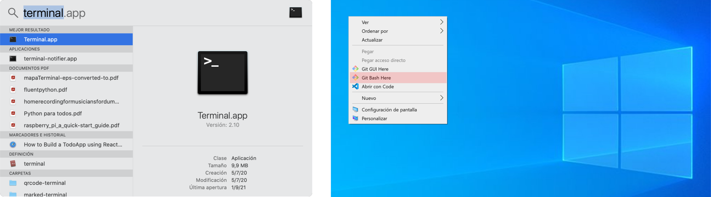 
</p>


En Windows también se puede trabajar con __Git__ perfectamente con los terminales `CMD` y `PowerShell`; solo habrá que tener en cuenta las consideraciones particulares relativas a la sintaxis de los comandos de los _shells_ de estos CLI de Windows, lo cual se deja a cargo del alumno si desea trabajar con ellos, aunque insistimos en que nos vamos a centrar exclusivamente con ejemplos basados en los CLI de tipo `Bash`.


### 2.1.1. Interfaces gráficas para Git

Existen numerosos programas con interfaces gráficas para trabajar con la funcionalidad de __Git__. Debido a su número y a su variedad tanto funcional como gráfica, estudiar toda la casuística sería muy amplio y probablemente siempre parcial. Los distintos programas gráficos emplean frecuentemente una notación distinta a la que podríamos considerar como convencional o típica en este contexto, lo que hace al principio difícil conocer el funcionamiento y los detalles de cada opción; sin embargo todos ellos, indpendientemente del que estemos hablando, internamente hacen _invocaciones a los comandos __Git___. Ya que nuestra intención es tratar de rentabilizar el aprendizaje y ya que el denominador común a todos los programas __Git__ es el conjunto de comandos __Git__, lo que haremos será centrarnos en la interfaz CLI y no manejaremos ninguna interfaz gráfica. 

Más adelante se manejarán programas muy variopintos que tendrán interfaces gráficas de __Git__, dejando a discreción del alumno la indagación entre la relación de las distintas interacciones gráficas con los comandos __Git__ que subyacen por detrás.


## 2.2. El _prompt_ y el directorio _home_

El _prompt_ del terminal es un indicador textual que nos _invita_ a introducir un comando en la consola para que sea interpretado y ejecutado por el _shell_. Suele contener informaciones explícitas del nombre de usuario, el directorio en el que nos encontramos (directorio actual o de trabajo) y algún símbolo delimitador (en ocasiones es el símbolo `$`, aunque esto se puede configurar); todas estas características dependen altamente del terminal y de cómo se haya configurado, pero muy probablemente será algo muy parecido a `<USUARIO>@<MAQUINA>:~/<DIRECTORIO>$` 
>Téngase especial atención a esta notación que será utilizada a partir de ahora: cuando un identificador vaya encerrado entre los signos `<` y `>` se pretende denotar que en una situación real, se debe sustituir por un valor concreto, es decir, si se pretendiera reproducir algún ejemplo en el que aparezca la expresión `<USUARIO>` lo que se debe hacer es sustituirlo por el valor correcto, por ejemplo `pepe`, por lo tanto si hacemos referencia a `<USUARIO>@<MAQUINA>:~/<DIRECTORIO>` genéricamente, un caso particular y real podría ser `pepe@portatil:~/Documents`.

>Para escribir el carácter de la virgulilla `~` en la pantalla,  se puede conseguir en una máquina Windows pulsando las teclas `<ALT-GR>+<4>` (alternativa gráfica y después el número 4); en Mac OS X, con `<ALT>+<Ñ>` (opción y después ñ) y en Linux con cualquiera de las dos combinaciones.

En la siguiente figura aparecen varios ejemplos de _prompt_.

<p align="center">  
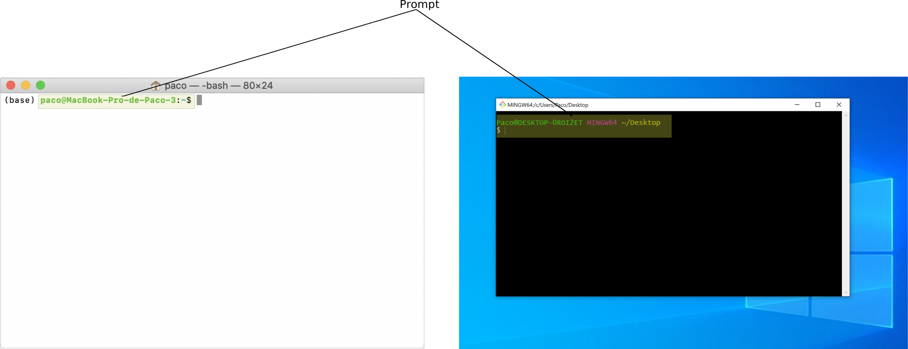 
</p>

La virgulilla `~` denota el directorio raíz del usuario `<USUARIO>` (también conocido como directorio _home_ del usuario), es decir, el directorio a partir del cual _cuelgan_ todos los directorios y ficheros propios y exclusivos del usuario, por lo que `<USUARIO>@<MAQUINA>:~/<DIRECTORIO>$` denota explícitamente que `~/<DIRECTORIO>` es el directorio de trabajo y que el directorio `<DIRECTORIO>` _cuelga_ directamente del directorio _home_ (`~`) del usuario `<USUARIO>` en el ordenador `<MAQUINA>`.


En la figura anterior podemos observar que el terminal de la izquierda tiene como directorio de trabajo el directorio _home_ del usuario (`~`), y el de la derecha, el directorio `Desktop` que cuelga, a su vez, del _home_ del usuario (`~`), es decir `~/Desktop`.

El directorio _home_ del usuario, `~`, tienen referencias distintas en el sistema de ficheros en función de la plataforma o sistema operativo en el que estemos, por ejemplo:
- En Windows (PowerShell): `~` equivale a `C:\Users\<USUARIO>`
- En Windows (Git Bash): `~` equivale a `/c/Users/<USUARIO>`
- En Mac OS X: `~ ` equivale a `/Users/<USUARIO>`
- En Linux: `~` equivale a `/home/<USUARIO>`

De este directorio _home_ del usuario cuelgan los directorios típicos de `Documents`, `Desktop`, `Downloads`, etc. 


> Si el ordenador en el que se trabaja es Windows y pertenece al laboratorio, es probable que el directorio `~` no sea el indicado en los párrafos anteriores, sino que de alguna manera puede que esté conectado a alguna unidad de red. Compruébese ejecutando:
> ```bash
> <USUARIO>@<MAQUINA>:~$ cd ~
> <USUARIO>@<MAQUINA>:~$ pwd
> ```
> o bien en la misma línea (obsérvese la sintaxis):
> ```bash
> <USUARIO>@<MAQUINA>:~$ cd ~; pwd
> ```
> observando si es algo parecido a `/c/Users/<USUARIO>`. Si no se obtiene este resultado  (recuérdese que  supuestamente estaríamos trabajando en una ventana de `Git Bash` de Windows en un ordenador de laboratorio), efectivamente, el directorio _home_ no tiene el valor esperado. Existen muchas soluciones para ello, pero vamos a optar por la más sencilla que consistirá en ejecutar lo siguiente:
> ```bash
> <USUARIO>@<MAQUINA>:~$ export HOME=/c/Users/<USUARIO>
> <USUARIO>@<MAQUINA>:~$ cd ~; pwd           # Verificación
> /c/Users/<USUARIO>
> ```
> Esto deberá hacerse cada vez que abramos una nueva ventana de `Git Bash` y deseemos que el directorio _home_ o raíz del usuario tome el valor deseado (esto podría automatizarse en el arranque, pero no lo vamos a contemplar de momento). Téngase también en cuenta el aspecto del directorio _home_, `~`,  en función de la arquitectura del ordenador.


En los siguientes subapartados veremos algunos comandos con algunas opciones. Dada la limitación de tiempo no podremos abarcar la casuística completa ni comandos ni de sus opciones, por lo que se deja para el alumno que motu proprio indague en el detalle de los comandos y opciones comentados y los no comentados buscando oportunamente en internet.

## 2.3. Los comandos `cd` y `pwd` 


El comando `cd <PATH>` (`cd` por _change directory_) cambia al directorio especificado por `<PATH>`, el cual indica de manera absoluta o relativa cómo llegar a él. En un entorno gráfico, lo podríamos traducir como cambiar a otra _carpeta_. 
>Recuérdese que por _path_ vamos a entender una secuencia de directorios concatenados. Cada directorio viene separado de su directorio hijo/padre con una carácter separador lo cual depende del sistema operativo y del terminal; así por ejemplo, en Linux y Mac OS X, el separador de directorios es el carácter `/`; en el terminal `CMD` de Windows, el separador de directorios es el carácter `\`; en `PowerShell` de Windows es indistintamente uno u otro. Si estamos en Windows vamos a trabajar con `Git Bash`, por lo que no tendremos confusión al respecto, pero si en algún momento cambiamos a otra terminal hay que tenerlo en consideración.

Si no se indica ningun directorio destino, se emplea uno por defecto: el directorio raíz o _home_ de usuario (por lo que `cd` sería equivalente a `cd ~`):

```bash
<USUARIO>@<MAQUINA>:~/<DIRECTORIO>$ cd 
<USUARIO>@<MAQUINA>:~$
```


El comando `pwd` (por _print working directory_) imprime en pantalla el _path_ absoluto del directorio en el que nos encontramos.

```bash
<USUARIO>@<MAQUINA>:~$ pwd
/Users/<USUARIO>
```

Es decir, el directorio `~` o _home_ del usuario `usuario` (que es donde actualmente se está) es `/Users/usuario`.
O bien

```bash
<USUARIO>@<MAQUINA>:~$ pwd
/home/<USUARIO>
```

O

```bash
<USUARIO>@<MAQUINA>:~$ pwd
c/Users/<USUARIO>
```

dependiendo del sistema operativo.


## 2.4. Otros directorios singulares

A continuación mostramos dos directorios singulares más, denominados:
- `./`: directorio __actual__, es decir, el directorio en el que se está
- `../`: directorio __padre__  del directorio actual

Con la siguiente representación gráfica se pretende expresar la relación entre carpetas o directorios y sus subcarpetas o subdirectorios o ficheros de la manera jerárquica con la que convencionalmente trabajamos con un sistema de ficheros.  Así pues, si estamos en el directorio `dirAA`  (denotado con un * para identificarlo fácilmente):


```
~
└── Desktop
    ├── dirA
    │   └── dirAA (*)
    │       └── fichero1
    └── dirB (**)
        └── fichero1
```

es decir, nuestro _prompt_ tiene el siguiente aspecto:

```bash
<USUARIO>@<MAQUINA>:~/Desktop/dirA/dirAA$
```

y queremos cambiar al directorio `dirB` (**), podríamos hacerlo de la siguiente manera:

```bash
<USUARIO>@<MAQUINA>:~/Desktop/dirA/dirAA$ cd ..
<USUARIO>@<MAQUINA>:~/Desktop/dirA$ cd ..
<USUARIO>@<MAQUINA>:~/Desktop/$ cd dirB
<USUARIO>@<MAQUINA>:~/Desktop/dirB$
```

O alternativamente, partiendo de nuevo de `~/Desktop/dirA/dirAA`, podríamos haberlo hecho en un solo paso: 

```bash 
<USUARIO>@<MAQUINA>:~/Desktop/dirA/dirAA$ cd ../../dirB   # Con ../ vamos al directorio padre, ~/Desktop/dirA/; con ../../, vamos al "abuelo" o padre del padre, ~/Desktop/; y de ahí ya a dirB: ~/Desktop/dirB

<USUARIO>@<MAQUINA>:~/Desktop/dirB$                       # El prompt ya nos indica que estamos en ~/Desktop/dirB
```


## 2.5. Directorio de trabajo y los comandos `mkdir` y `ls`

Una de las primeras cosas que debemos hacer cuando estamos organizando los preliminares de un proyecto es elegir el directorio de trabajo, es decir la carpeta en la que vamos a incluir todos los ficheros del mismo, sea este del tipo que sea. Estamos muy habituados a hacerlo en una interfaz gráfica simplemente seleccionando alguna carpeta inicial y creando ahí una `Nueva Carpeta` a la que le cambiaremos el nombre a uno más significativo.

Una sugerencia puede ser crear la carpeta `TS1-GTDM` (por _Taller Seminario 1 de GTDM_) en el escritorio o carpeta `Desktop`, y bajo `TS1-GTDM`, crear a su vez la carpeta `Practica1`. De forma relativa al directorio _raíz_ o _home_ del usuario,  podríamos ubicar las carpetas indicadas del siguiente modo:

```
~
└── Desktop
    └── TS1-GTDM
        └── Practica1
```

Es decir, el directorio _home_ `~` contiene a la carpeta `Desktop`, esta a `TS1-GTDM`y esta, a su vez, a `Practica1`.

Muy probablemente sabremos realizar estas operaciones con la interfaz gráfica, pero vamos a aprender a hacerlas con la interfaz textual o CLI. Para ello emplearemos el comando `mkdir <DIRECTORIO>` el cual crea un nuevo directorio o carpeta con el nombre indicado tomando como _referencia_ el directorio de trabajo.
Para ello arranquemos un terminal y...

```bash
<USUARIO>@<MAQUINA>:~$ cd                                   # Aunque ya estamos en el home del usuario, con este comando sin argumento nos aseguramos de ir a dicho home del usuario, estemos donde estemos

<USUARIO>@<MAQUINA>:~$ cd Desktop                           # Cambiamos al escritorio

<USUARIO>@<MAQUINA>:~/Desktop$ mkdir TS1-GTDM               # Con esto deberíamos observar una nueva carpeta en el escritorio con ese nombre

<USUARIO>@<MAQUINA>:~/Desktop$ cd TS1-GTDM                  # Cambiamos a directorio TS1-GTDM como nuevo directorio de trabajo

<USUARIO>@<MAQUINA>:~/Desktop/TS1-GTDM$ mkdir Practica1     # Creamos la carpeta Practica1

<USUARIO>@<MAQUINA>:~/Desktop/TS1-GTDM$ cd Practica1        # Cambiamos a la carpeta Practica1

<USUARIO>@<MAQUINA>:~/Desktop/TS1-GTDM/Practica1$ pwd       # Verificamos el directorio en el que estamos
/c/Users/usuario/Desktop/TS1-GTDM/Practica1
```


---
__Ejercicio__: ábrase un _terminal/Git Bash_, ejecútense los comandos indicados anteriormente verificando gráficamente a partir del escritorio del ordenador que se han creado las carpetas indicadas. Muévase por los directorios empleando el comando `cd` y utilizando algún directorio singular como `../`(por ejemplo, muévase del directorio `Practica1` a `Desktop` de manera directa, sin dar _pasos_ intermedios, después vuelva de nuevo a `Practica1` en un solo paso; luego vuélvase a `Desktop` en dos pasos, pasando por tanto por `TS1-GTDM`; vuelva a `Practica1` en dos pasos...).

Tómese nota en un fichero de texto, denominado `Ejercicios.txt`, (ubicado, de momento, bajo el directorio `Practica1`) de todos los comandos que se han ido ejecutando para entregarlos como prueba documental de la realización del ejercicio, añadiendo los comentarios que al alumno le parezcan oportunos.

---


El comando `ls` _lista_ o imprime  en la pantalla un listado del contenido del directorio especificado (sus ficheros y directorios hijos). Si no se especifica ningun directorio, por defecto, lista el directorio actual o de trabajo. Por ejemplo:

```bash
<USUARIO>@<MAQUINA>:~/Desktop/TS1-GTDM/Practica1$ cd ../../  # Cambiamos al directorio "abuelo"; en este caso también valdría ../..

<USUARIO>@<MAQUINA>:~/Desktop$ ls TS1-GTDM
Practica1

<USUARIO>@<MAQUINA>:~/Desktop$ cd TS1-GTDM 

<USUARIO>@<MAQUINA>:~/Desktop/TS1-GTDM$ ls                   # sin argumento, se lista contenido del directorio actual
Practica1

<USUARIO>@<MAQUINA>:~/Desktop/TS1-GTDM$ ls Practica1         # lista el contenido del directorio Practica1, que es Ejercicios.txt
Ejercicios.txt

<USUARIO>@<MAQUINA>:~/Desktop/TS1-GTDM$ ls ../TS1-GTDM/Practica1  # dando un pequeño rodeo (hacia arriba y luego hacia abajo...)
Ejercicios.txt


```

Lo cual es fácilmente verificable si recordamos la estructura de directorios:


```
~
└── Desktop
    └── TS1-GTDM
        └── Practica1
            └── Ejercicios.txt
```

---
__Ejercicio__: ejecútense los comandos indicados anteriormente verificando que se obtiene los mismos resultados en la ventana de comandos.

Recuérdese añadir los comandos ejecutados en el fichero `Ejercicios.txt`.

---

## 2.6. Interacción con el interfaz gráfico del sistema operativo y los comandos `cat` y `echo`

Aunque ya se ha ido haciendo anteriormente, a continuación se propone interactuar gráficamente con la máquina, tal y como se hace habitualmente, para observar cómo realmente por detrás subyace el mismo sistema, siendo la única diferencia la forma en la que se interactúa y se muestra la información: bien gráfica, bien textual.

Para ello créese convencionalmente (gráficamente, es decir, boton derecho y `Nueva ventana`) una carpeta que _cuelgue_ de `Practica1` y se denomine `dir1`. A continuación, ábrase un editor gráfico de texto __plano__ (Visual Studio Code, Sublime, Atom, NotePad++, ...) y edítese un fichero con un contenido arbitrario y guárdese con el nombre `fichero1.txt` en el directorio `dir1`.

Váyase a la línea de comandos y lístese el fichero en cuestión, verificando que existe.

Hay un comando denominado `cat <FICHERO>` que escribe por pantalla el contenido del fichero `<FICHERO>`. Compruébese que efectivamente se muestra el contenido de dicho fichero.

Como alternativa a estos editores de texto plano basados en interacción gráfica (Visual Studio, Sublime, Atom, ...), existen editores de ficheros que trabajan en línea de comandos (por ejemplo `vi` o `vim`, `nano`, ...). Su uso es al principio más tedioso requiriendo una curva de aprendizaje costosa, pero cuando se adquiere cierta habilidad son normalmente mucho más potentes, versátiles y rápidos que los editores gráficos.


También existen formas alternativas de crear ficheros en línea de comandos, simplemente añadiendo líneas al mismo. Por ejemplo, el comando `echo` puede utilizarse para ello. Veamos todas estas ideas en los siguientes ejemplos:

```bash
<USUARIO>@<MAQUINA>:~/Desktop/TS1-GTDM$ cd Practica1/dir1                                   # Se supone que dir1 fue creado desde el entorno de ventanas

<USUARIO>@<MAQUINA>:~/Desktop/TS1-GTDM/Practica1/dir1$ cd ~/Desktop/TS1-GTDM/Practica1/dir1 # O bien, vamos de manera absoluta a dir1. Es equivalente, en estas circunstancias, a la instrucción anterior, pero el path es absoluto en vez de relativo

<USUARIO>@<MAQUINA>:~/Desktop/TS1-GTDM/Practica1/dir1$ cat fichero1.txt                     # Se supone que fichero1.txt fue creado con un editor gráfico de texto plano
<EL CONTENIDO QUE SE HAYA ESCRITO CON EL EDITOR DE TEXTO PLANO>

<USUARIO>@<MAQUINA>:~/Desktop/TS1-GTDM/Practica1/dir1$ echo "Hola" > fichero2.txt           # con >, el argumento de echo lo vuelca en un fichero nuevo (si antes existía y tenía contenido, se pierde)

<USUARIO>@<MAQUINA>:~/Desktop/TS1-GTDM/Practica1/dir1$ ls                                   # lista el contenido del directorio actual
fichero2.txt

<USUARIO>@<MAQUINA>:~/Desktop/TS1-GTDM/Practica1/dir1$ cat fichero2.txt                     # imprime el contenido del fichero indicado
Hola

<USUARIO>@<MAQUINA>:~/Desktop/TS1-GTDM/Practica1/dir1$ echo "Adiós" >> fichero2.txt         # con >> añade el string indicado al fichero especificado, no perdiendo, por tanto, el contenido original

<USUARIO>@<MAQUINA>:~/Desktop/TS1-GTDM/Practica1/dir1$ cat fichero2.txt
Hola
Adiós

<USUARIO>@<MAQUINA>:~/Desktop/TS1-GTDM/Practica1/dir1$ echo "Contenido nuevo" > fichero2.txt  # se crea nuevo y se pierde contenido anterior

<USUARIO>@<MAQUINA>:~/Desktop/TS1-GTDM/Practica1/dir1$ cat fichero2.txt                     
Contenido nuevo

<USUARIO>@<MAQUINA>:~/Desktop/TS1-GTDM/Practica1/dir1$ echo "Otro fichero" >> fichero3.txt  # >> equivale a > si fichero no existía antes

<USUARIO>@<MAQUINA>:~/Desktop/TS1-GTDM/Practica1/dir1$ cat fichero3.txt
Otro fichero

<USUARIO>@<MAQUINA>:~/Desktop/TS1-GTDM/Practica1/dir1$ ls                                   # se listan los ficheros del directorio actual
fichero1.txt fichero2.txt fichero3.txt
```

Ábranse con alguno de los programas gráficos de edición de texto plano anteriormente usados o citados (Visual Studio Code, Sublime Text, Atom, Notepad++, ...) todos los ficheros creados textualmente comprobando que el contenido es el que debe.


El comando `touch <FICHERO>` solo actualiza la fecha de modificación del fichero (si el fichero ya existe); si `<FICHERO>` no existe, se crea uno vacío.

```bash
<USUARIO>@<MAQUINA>:~/Desktop/TS1-GTDM/Practica1/dir1$ cat fichero3.txt    # Contenido de fichero3.txt
Otro fichero

<USUARIO>@<MAQUINA>:~/Desktop/TS1-GTDM/Practica1/dir1$ touch fichero3.txt

<USUARIO>@<MAQUINA>:~/Desktop/TS1-GTDM/Practica1/dir1$ cat fichero3.txt    # Mismo contenido tras touch (solo se cambia fecha de última modificación)
Otro fichero

<USUARIO>@<MAQUINA>:~/Desktop/TS1-GTDM/Practica1/dir1$ cat fichero4.txt    # Este fichero no existe
cat: fichero4.txt: No such file or directory

<USUARIO>@<MAQUINA>:~/Desktop/TS1-GTDM/Practica1/dir1$ touch fichero4.txt

<USUARIO>@<MAQUINA>:~/Desktop/TS1-GTDM/Practica1/dir1$ cat fichero4.txt    # Ahora sí, pero está vacío

<USUARIO>@<MAQUINA>:~/Desktop/TS1-GTDM/Practica1/dir1$ ls
fichero1.txt fichero2.txt fichero3.txt fichero4.txt
```


---
__Ejercicio__: síganse las indicaciones anteriores para crear los ficheros indicados tanto gráfica como textualmente, haciendo las comprobaciones que se exigen.

Añádanse los comandos y los comentarios oportunos en el fichero `Ejercicios.txt`.

---


## 2.7. Directorios ocultos

Todos los sistemas operativos que contemplamos en la práctica permiten tener directorios ocultos, es decir, directorios que _normalmente_ no son listados o visualizados y que, tal y como su calificativo indica, están ocultos, pero están ahí. El motivo por el que se ocultan suele ser provocar que el usuario no sea consciente de su existencia y así no interfiera en los mismos, pues pueden contener información importante o sensible para el funcionamiento de cierto software.

Hay una convención que se respeta en prácticamente todas las plataformas y es que cuando un fichero o directorio comienza por punto `.`, entonces este debe ser oculto y por lo tanto, no debe ser mostrado _normalmente_.

Como comprobaremos posteriormente, __Git__ almacena el repositorio de un directorio de trabajo en un directorio oculto dentro del propio directorio de trabajo. Este directorio oculto se denomina `.git`. Como vemos respeta el convenio de comenzar el nombre con un punto ya que la intención es que sea oculto.

En muchas ocasiones, nos será necesario, o por algún motivo desearemos poder visualizar estos directorios ocultos. Esto se puede hacer fácilmente desde la línea de comandos empleando la opción `-a` del comando `ls`

```bash
<USUARIO>@<MAQUINA>:~/Desktop/TS1-GTDM$ ls
Practica1

<USUARIO>@<MAQUINA>:~/Desktop/TS1-GTDM$ ls -a
Practica1
```

Podemos comprobar cómo en este caso, el directorio `TS1-GTDM` __no__ contiene ningún directorio o fichero oculto (salen los mismos con la opción `-a` que sin ella); posteriormente veremos algún ejemplo con ficheros ocultos.

La forma con la que se puede mostrar un fichero oculto __gráficamente__ en una ventana depende de la plataforma. Por ejemplo

- Windows: una opción puede ser desde el Explorador de Archivos, clicar la pestaña Vista y seleccionar la opción _Elementos ocultos_ (ubicada por la derecha)

- MAC OS X: una solución puede ser `<CMD>+<SHIFT>+<.>` con la que se conmuta la visibilidad/invisibilidad de los ficheros o directorios ocultos

- Linux: `<CTRL>+<h>` con la que se conmuta la visibilidad/invisibilidad de los contenidos de la carpeta en la que se está.


## 2.8 Mover y copiar ficheros 

El comando `mv` permite cambiar la ubicación de un fichero o renombrarlo, por ejemplo:

```bash
<USUARIO>@<MAQUINA>:~$ cd ~/Desktop/GTDM/Practica1/dir1 

<USUARIO>@<MAQUINA>:~/Desktop/GTDM/Practica1/dir1$ ls
fichero1.txt fichero2.txt fichero3.txt fichero4.txt

<USUARIO>@<MAQUINA>:~/Desktop/GTDM/Practica1/dir1$ mv fichero1.txt fichero5.txt         # cambia el nombre de fichero1.txt a fichero5.txt

<USUARIO>@<MAQUINA>:~/Desktop/GTDM/Practica1/dir1$ ls
fichero2.txt fichero3.txt fichero4.txt fichero5.txt

<USUARIO>@<MAQUINA>:~/Desktop/GTDM/Practica1/dir1$ mkdir dir2

<USUARIO>@<MAQUINA>:~/Desktop/GTDM/Practica1/dir1$ ls
dir2 fichero2.txt fichero3.txt fichero4.txt fichero5.txt

<USUARIO>@<MAQUINA>:~/Desktop/GTDM/Practica1/dir1$ mv fichero2.txt dir2/fichero2.txt    # cambia la ubicación de fichero2.txt de dir1 a dir1/dir2, renombrándolo de la misma manera

<USUARIO>@<MAQUINA>:~/Desktop/GTDM/Practica1/dir1$ ls
dir2 fichero3.txt fichero4.txt fichero5.txt

<USUARIO>@<MAQUINA>:~/Desktop/GTDM/Practica1/dir1$ mv fichero3.txt dir2                 # CUIDADO: segundo argumento de mv es un directorio, entonces, comportamiento especial: fichero3.txt va a dir2. Se debe ser cuidadoso con la sintaxis

<USUARIO>@<MAQUINA>:~/Desktop/GTDM/Practica1/dir1$ ls dir2
fichero2.txt fichero3.txt

<USUARIO>@<MAQUINA>:~/Desktop/GTDM/Practica1/dir1$ ls
dir2 fichero4.txt fichero5.txt

<USUARIO>@<MAQUINA>:~/Desktop/GTDM/Practica1/dir1$ mv dir2/fichero3.txt .               # CUIDADO: de nuevo, el segundo argumento es un directorio: el actual

<USUARIO>@<MAQUINA>:~/Desktop/GTDM/Practica1/dir1$ ls
dir2 fichero3.txt fichero4.txt fichero5.txt

<USUARIO>@<MAQUINA>:~/Desktop/GTDM/Practica1/dir1$ cd dir2

<USUARIO>@<MAQUINA>:~/Desktop/GTDM/Practica1/dir1/dir2$ ls
fichero2.txt
```

Téngase especial cuidado con este comando si no se tiene una mínima experiencia, por las consecuencias que puediera conllevar ya que la sintaxis puede llegar a ser crítica. Si no se conoce con detalle las consecuencias de ejecución de este comando, es preferible actuar _gráficamente_, es decir, arrastrando los ficheros de una ventana a otra.

El comando `cp` permite copiar ficheros de un origen a un destino (manteniendo, por tanto, la copia original), con consideraciones similares a `mv`.  Si continuamos desde el estado en el que nos quedamos anteriormente:

```bash
<USUARIO>@<MAQUINA>:~/Desktop/GTDM/Practica1/dir1$ ls
dir2 fichero3.txt fichero4.txt fichero5.txt

<USUARIO>@<MAQUINA>:~/Desktop/GTDM/Practica1/dir1$ cp fichero3.txt fichero6.txt

<USUARIO>@<MAQUINA>:~/Desktop/GTDM/Practica1/dir1$ ls
dir2 fichero3.txt fichero4.txt fichero5.txt fichero6.txt

<USUARIO>@<MAQUINA>:~/Desktop/GTDM/Practica1/dir1$ cp fichero3.txt dir2/fichero3_bis.txt

<USUARIO>@<MAQUINA>:~/Desktop/GTDM/Practica1/dir1$ ls
dir2 fichero3.txt fichero4.txt fichero5.txt fichero6.txt

<USUARIO>@<MAQUINA>:~/Desktop/GTDM/Practica1/dir1$ ls dir2
fichero2.txt fichero3_bis.txt                           # fichero2.txt fue "movido" en el ejemplo anterior, y fichero3.txt, "copiado" en este renombrándolo como fichero3_bis.txt
```


## 2.9. Borrado de ficheros y directorios

Evidentemente existen comandos para realizar el borrado de ficheros y directorios, pero su ejecución es potencialmente peligrosa. En caso de ser necesario borrar algún fichero o directorio, se sugiere que esto se haga gráficamente, es decir, a nivel de ventanas, ya que los sistemas operativos permitirían recuperarlo de la papelera, en caso de querer revertir la acción. Esto no ocurriría en línea de comandos, es decir, si ejecutamos el comando de borrado de un fichero o directorio, lo perderemos definitivamente (este comportamiento se puede modificar, pero no lo vamos a hacer por las implicaciones que puede conllevar). 

Si en algún momento nos vemos obligados a borrar un directorio o fichero oculto desde el entorno gráfico de ventanas, evidentemente, primero deberemos hacerlo visible para a continuación borrarlo.

# 3. Configuración y primeros usos de __Git__

En el apartado previo ya se procedió a la instalación de __Git__. A continuación vamos a proceder a su configuración.


## 3.1. Configuración de __Git__

Vamos a mostrar dos tipos de configuraciones: una global para cualquier  repositorio que ya tengamos o vayamos a tener en el futuro en nuestra cuenta de usuario de la máquina local y otra particular para un repositorio en concreto. De esa manera podremos tener configuraciones distintas en proyectos distintos. (Existe otro nivel de configuración, denominado de sistema, que no vamos a abordar.)

### 3.1.1. Configuración global de __Git__

Se sugiere que se ejecuten los siguientes comandos en una ventana de CLI (en este caso, el directorio en el que se ejecuten los mismos es  indiferente):

```bash
<USUARIO>@<MAQUINA>:~$ git config --global user.name <INDICAD_VUESTRO_NOMBRE_ENTRE_COMILLAS_PARA_CONTEMPLAR_ESPACIOS>

<USUARIO>@<MAQUINA>:~$ git config --global user.email <INDICAD_VUESTRO_EMAIL_AQUI_NO_HARIAN_FALTA_COMILLAS_YA_QUE_NO_HABRA_ESPACIOS_EN_BLANCO_EN_EL_EMAIL>

<USUARIO>@<MAQUINA>:~$ git config --list          # Aparecerá un listado con todos los ítems configurados,
                                                  # entre ellos, los que se han especificado: nombre y email.
                                                  # Verificad que todo es correcto
```

Estos datos que se proporcionan son para poder identificar al autor de cualquier tipo de maniobra en el repositorio (tendrá sentido práctico si en el futuro el repositorio es público y compartido).  No se hace ningún tipo de comprobación ni de uso ni del nombre ni del email; su intención es exclusivametne la de (auto-)identificación.

Con esto ya tenemos configurados los parámetros mínimos para que funcione __Git__. Esta configuración será la empleada en cualquier repositorio de este usuario en esta máquina, a no ser que en el repositorio en cuestión, hagamos una configuración _particular_.


#### Configuración del editor de textos

En ocasiones hay que añadir mensajes a ciertos comandos __Git__, por ejemplo, para el comando `git commit -m "Mensaje"`, como estudiaremos en sucesivas prácticas. Normalmente es muy práctico añadir mensajes breves de esta manera en la misma línea de comandos; en otras ocasiones, quizá se desee detallar mucho más un mensaje, por lo que sería más cómodo abrir _automáticamente_ un editor de textos en el que realizar esta labor. Esto se consigue omitiendo la opción `-m "Mensaje"` por lo que deberíamos escribir simplemente `git commit`, con el ejemplo citado. 

Ya hay un editor de textos configurado por defecto para que sea invocado en estas circunstancias: `vi` o `vim`. Si no se posee habilidad en el manejo de este editor de textos, puede programarse el arranque de otro alternativo a gusto del usuario. 

Vamos a dar indicaciones para configurar el editor de texto plano `Visual Studio Code` (cuyo ejecutable se denomina `code` en Mac OS X y Linux, y `Code.exe` en Windows) como editor de textos por defecto. __Alguna__ de las siguientes alternativas podría ser válida (ejecútese, en principio, solo una alternativa) en, por ejemplo, una configuración _global_:

```bash
<USUARIO>@<MAQUINA>:~$ git config --global core.editor "code --wait"                                                                        # Si está accesible vía PATH en cualquier arquitectura

<USUARIO>@<MAQUINA>:~$ git config --global core.editor "'/Applications/Visual Studio Code.app/Contents/Resources/app/bin/code' --wait"      # en Mac OS X

<USUARIO>@<MAQUINA>:~$ git config --global core.editor "'C:\Program Files (x86)\Microsoft VS Code\Code.exe' --wait"                         # en Windows

<USUARIO>@<MAQUINA>:~$ git config --global core.editor "'C:\Users\{UserName}\AppData\Local\Programs\Microsoft VS Code\Code.exe' --wait"     # en Windows, si la instalación es local al usuario
```

La primera forma indicada suele funcionar en cualquier plataforma (siempre y cuando  ejecutando `code` desde la línea de comandos arranque `Visual Studio Code`); en caso contrario hay que determinar el _path_ de ejecución del editor e indicarlo explícitamente en el argumento tal y como se pretende en las alternativas subsiguientes. En cualquier caso, ténganse en cuenta las comillas dobles y simples que aparecen por si surgiera algún error o mala interpretación de los parámetros en la configuración. 

La forma de verificar si se ha configurado correctamente el editor será ejecutando algún comando de __Git__ que lo requiera, comprobando que el editor arranca automáticamente, por lo tanto, posponemos esta verificación. Téngase en cuenta que deberíamos volver a revisar este subapartado, si el editor no arranca exitosamente con estos comandos que requieren mensajes como parámetros.


---
__Ejercicio__: realícese la configuración del editor quedando pendiente su verificación posterior.

---


Si en algún momento se desea volver al editor por defecto, la instrucción sería:

```bash
<USUARIO>@<MAQUINA>:~$ git config --global --unset core.editor
```

Recuérdese que esta configuración al ser global se aplicará a todos los repositorios del usuario en cuestión. Si en algún momento deseamos desviarnos de esta configuración _global_ debemos proceder con una _local_, tal y como vamos a ver a continuación.

### 3.1.2. Configuración local o particular de __Git__

A continuación se propone que se ejecute una configuración concreta para un repositorio, es decir, una configuración _local_ o _particular_, no afectando a la de otros repositorios. Por ende, dado un repositorio concreto, un item configurado _globalmente_ será sobreescrito por la configuración correspondiente _local_ en dicho repositorio. Para ello tendremos que:
- Crear un directorio 
- Configurar su _versionado_ o control bajo __Git__

Lo denominaremos  `repo1` bajo la carpeta `Practica1` que previamente ya creamos:

```bash
<USUARIO>@<MAQUINA>:~$ cd ~/Desktop/TS1-GTDM/Practica1           # Estemos donde estemos, vamos directamente al directorio Practica1 creado anteriormente

<USUARIO>@<MAQUINA>:~/Desktop/TS1-GTDM/Practica1$ mkdir repo1    # Creamos el directorio o carpeta repo1

<USUARIO>@<MAQUINA>:~/Desktop/TS1-GTDM/Practica1$ cd repo1       # Nos cambiamos a dicho directorio
```

Quedando como:

```
~
└── Desktop
    └── TS1-GTDM
        └── Practica1
            ├── Ejercicios.txt
            ├── dir1
            │   ├── dir2
            │   │   └── ...
            │   └── ...
            └── repo1
```

Ya tenemos entonces el directorio de trabajo creado para el ejemplo  y estamos en él. Vamos a configurar __Git__ particularmente para este directorio `repo1`.

>__Importante__: recuérdese que para llevar a cabo una configuración local de un repositorio es necesario que este esté incializado &#8212;con `git init`&#8212;

```bash
<USUARIO>@<MAQUINA>:~/Desktop/TS1-GTDM/Practica1/repo1$ git init           # inicialización del directorio de trabajo (~/Desktop/TS1-GTDM/Practica1/repo1) para ser versionado por git
Initialized empty Git repository in /Users/usuario/Desktop/TS1-GTDM/Practica1/repo1/.git/
                                                                           # una consecuencia de la ejecución de git init es la creación de toda la infraestructura del versionado en el nuevo directorio creado .git

<USUARIO>@<MAQUINA>:~/Desktop/TS1-GTDM/Practica1/repo1$ ls                 # tras git init, aparentemente no hay ningún directorio

<USUARIO>@<MAQUINA>:~/Desktop/TS1-GTDM/Practica1/repo1$ ls -la             # la realidad es que sí que lo hay, pero estaba oculto: .git
.git

<USUARIO>@<MAQUINA>:~/Desktop/TS1-GTDM/Practica1/repo1$ git config --local user.name <INDICAD_VUESTRO_NOMBRE_ENTRE_COMILLAS_PARA_CONTEMPLAR_ESPACIOS>

<USUARIO>@<MAQUINA>:~/Desktop/TS1-GTDM/Practica1/repo1$ git config --local user.name <INDICAD_VUESTRO_EMAIL>

<USUARIO>@<MAQUINA>:~/Desktop/TS1-GTDM/Practica1/repo1$ git config --local core.editor "code --wait"        # O la opción oportuna

<USUARIO>@<MAQUINA>:~/Desktop/TS1-GTDM/Practica1/repo1$ git config --list
...                                                                             # listado de todos los items de configuración
```

Obsérvese como al utilizar la opción `--local` indicamos a __Git__ que la configuración a la que estamos haciendo mención deseamos que sea exclusiva para el repositorio contenido en el directorio en el que nos encontramos. Para el resto de nuestros directorios versionados se aplicarán sus respectivas configuraciones _locales_ o en su defecto, la _global_.


Asimismo, al listar la configuración con la opción `--list`, podemos comprobar cómo además de los items configurados globalmente, aparecen también estos locales que prevalecen sobre los globales en este repositorio.


También podemos comprobar fácilmente cómo al inicializar un repositorio mediante el comando `git init`, automáticamente se crea el directorio oculto `.git` al observar la salida del comando `ls -a` (recuérdese que es necesaria la opción `-a` para poder visualizar además los ficheros ocultos). 


>__Muy importante__: el contenido del directorio `.git` __jamás__ debe ser modificado, ya que, en tal caso, es muy probable que dejemos el repositorio en un estado no operativo si no conocemos suficientes detalles del sistema __Git__.
>Así mismo, deberíamos ser cuidadosos con dónde ejecutamos el comando `git init` ya que si lo ejecutamos en cierta carpeta y después volvemos a ejecutarlo en alguna subcarpeta de esta, probablemente tendremos problemas. Por lo tanto se debería ser muy cuidadoso en este sentido para ahorrar tiempo al buscar la causa de algunos problemas con __Git__. Esta es una causa de __errores__ muy __frecuente__.


Se propone a continuación inicializar un nuevo repositorio de una forma más directa: se denominará `repo2` y tal y como le ocurría a `repo1`, _colgará_ de `Practica1`:

```bash
<USUARIO>@<MAQUINA>:~/Desktop/TS1-GTDM/Practica1/repo1$ cd ..      # Vamos de manera relativa al directorio padre: Practica1

<USUARIO>@<MAQUINA>:~/Desktop/TS1-GTDM/Practica1$ ls               # contenido de Practica1
dir1 repo1 Ejercicios.txt 

<USUARIO>@<MAQUINA>:~/Desktop/TS1-GTDM/Practica1$ git init repo2   # En este ejemplo, se inicializa el directorio especificado, repo2 (no en el de trabajo, tal y como ocurrió en el ejemplo de git init anterior), no siendo necesario, en este caso, que exista previamente

<USUARIO>@<MAQUINA>:~/Desktop/TS1-GTDM/Practica1$ ls
dir1 repo1 repo2 Ejercicios.txt                                    # aparición de repo2 (ya inicializado para uso con git)

<USUARIO>@<MAQUINA>:~/Desktop/TS1-GTDM/Practica1$ cd repo2         # Vamos a repo2

<USUARIO>@<MAQUINA>:~/Desktop/TS1-GTDM/Practica1/repo2$ ls -a
.git                                                               # directorio .git oculto generado por git init
```

De format alternativa, en vez de la secuencia anterior de instrucciones, podríamos emplear las que vienen a continuación, consiguiendo exactamente los mismos resultados (elíjase, por tanto, una secuencia u otra, no las dos):


```bash
<USUARIO>@<MAQUINA>:~/Desktop/TS1-GTDM/Practica1/repo1$ cd ..      # Vamos al directorio padre: Practica1

<USUARIO>@<MAQUINA>:~/Desktop/TS1-GTDM/Practica1$ mkdir repo2

<USUARIO>@<MAQUINA>:~/Desktop/TS1-GTDM/Practica1$ cd repo2

<USUARIO>@<MAQUINA>:~/Desktop/TS1-GTDM/Practica1/repo2$ git init

<USUARIO>@<MAQUINA>:~/Desktop/TS1-GTDM/Practica1/repo2$ 
```

En este momento, deberíamos tener la presente estructura de directorios y subdirectorios:

```
~
└── Desktop
    └── TS1-GTDM
        └── Practica1
            ├── Ejercicios.txt
            ├── dir1
            │   ├── dir2
            │   │   └── ...
            │   └── ...
            ├── repo1
            │   └── .git
            └── repo2            
                └── .git             
```

---


__Ejercicio__: créese el repositorio `repo1` y configúrese tal y como se ha indicado en los párrafos anteriores. Créese también el repositorio `repo2` con las consideraciones indicadas. ¿Qué configuración aplica a `repo2`, la global o la particular especificada para `repo1`?

Recuérdese anotar los comandos ejecutados y las respuestas exigidas en el fichero `Ejercicios.txt`.

---

## 3.2. Primer ejemplo de clonación

Aunque todavía falta conocer bastantes detalles sobre la interrelación entre repositorios locales y repositorios remotos, en este momento ya podemos hacer algunas pruebas de clonación para verificar que todo funciona de la manera esperada.

Vamos a realizar una clonación de un repositorio remoto ubicado en __GitHub__ y que es __público__; el hecho de ser _público_ es el motivo por el que podemos hacer la clonación ya, sin la necesidad de tener una cuenta de usuario de __GitHub__. 
Recuérdese que la forma genérica del comando es: 

```bash
<USUARIO>@<MAQUINA>:~/.../<DIR_TRABAJO>$ git clone <URL_REPOSITORIO_REMOTO> <DIRECTORIO>
```

Vamos a ver varias opciones (solo se debería ejecutar una) que proporcionan idéntico resultado, en función del valor del parámetro `<DIRECTORIO>` y del directorio desde donde se ejecuta el comando (`<DIR_TRABAJO>`). En cualquier caso, la URL del repositorio remoto, es decir, `<URL_REPOSITORIO_REMOTO>` será:

```
https://github.com/GIT-GTDM-21-22/Prueba1
``` 

>__GitHub__ admite también  indistinta y equivalentemente nombres de repositorios acabados o no en `.git`: `https://github.com/GIT-GTDM-21-22/Prueba1.git`

La última parte de dicha URL (`Prueba1`) indica siempre el _nombre_ del repositorio, por lo tanto el repositorio se denomina `Prueba1` y el _propietario_ es `GIT-GTDM-21-22`. Esta será la estructura típica de la URL de un repositorio remoto alojado en __GitHub__ (`github.com`) cuyo esquema de acceso es `https`, es decir HTTP seguro.

Algunas posibilidades (exclusivas, no se debería ejecutar más de una):

- Proporcionamos un directorio destino: `Prueba1` (lo hemos hecho coincidir deliberadamente con el nombre del repositorio, pero no tiene porqué ser así). Al final ejecutamos el comando `ls` para observar el contenido del directorio `Practica1`:

    ```bash
    <USUARIO>@<MAQUINA>:~$ cd ~/Desktop/TS1-GTDM/Practica1    # Estemos donde estemos vamos a Practica1

    <USUARIO>@<MAQUINA>:~/Desktop/TS1-GTDM/Practica1$ ls
    dir1 repo1 repo2 Ejercicios.txt
    
    <USUARIO>@<MAQUINA>:~/Desktop/TS1-GTDM/Practica1$ git clone https://github.com/GIT-GTDM-21-22/Prueba1 Prueba1     # Aquí <DIRECTORIO> = Prueba1
    Cloning into 'Prueba1'...
    remote: Enumerating objects: 5, done.
    remote: Counting objects: 100% (5/5), done.
    remote: Compressing objects: 100% (2/2), done.
    remote: Total 5 (delta 0), reused 5 (delta 0), pack-reused 0
    Unpacking objects: 100% (5/5), done.
    
    <USUARIO>@<MAQUINA>:~/Desktop/TS1-GTDM/Practica1$ ls
    Prueba1 dir1 repo1 repo2 Ejercicios.txt       # Aquí observamos que ha surgido el directorio Prueba1

    <USUARIO>@<MAQUINA>:~/Desktop/TS1-GTDM/Practica1$ ls Prueba1
    carpeta fichero.txt                           # Su contenido es un directorio y un fichero
    ```

- O bien, no indicamos ningún directorio destino, en cuyo caso, __Git__ actúa como si le hubiéramos especificado uno con el mismo nombre que el repositorio remoto, `Prueba1`:

    ```bash
    <USUARIO>@<MAQUINA>:~$ cd ~/Desktop/TS1-GTDM/Practica1    # Estemos donde estemos vamos a Practica1
    
    <USUARIO>@<MAQUINA>:~/Desktop/TS1-GTDM/Practica1$ ls
    dir1 repo1 repo2 Ejercicios.txt

    <USUARIO>@<MAQUINA>:~/Desktop/TS1-GTDM/Practica1$ git clone https://github.com/GIT-GTDM-21-22/Prueba1      # Aquí <DIRECTORIO> = NADA
    Cloning into 'Prueba1'...
    remote: Enumerating objects: 5, done.
    remote: Counting objects: 100% (5/5), done.
    remote: Compressing objects: 100% (2/2), done.
    remote: Total 5 (delta 0), reused 5 (delta 0), pack-reused 0
    Unpacking objects: 100% (5/5), done.
    
    <USUARIO>@<MAQUINA>:~/Desktop/TS1-GTDM/Practica1$ ls
    Prueba1 dir1 repo1 repo2 Ejercicios.txt       # Aquí observamos que ha surgido el directorio Prueba1

    <USUARIO>@<MAQUINA>:~/Desktop/TS1-GTDM/Practica1$ ls Prueba1
    carpeta fichero.txt                           # Su contenido es un directorio y un fichero
    ```

- O bien, creamos un directorio (`Prueba1`, aunque podría haber sido cualquier otro nombre), nos introducimos en él y especificamos como directorio destino, el directorio actual (con un punto `.`):

    ```bash
    <USUARIO>@<MAQUINA>:~$ cd ~/Desktop/TS1-GTDM/Practica1    # Estemos donde estemos vamos a Practica1
    
    <USUARIO>@<MAQUINA>:~/Desktop/TS1-GTDM/Practica1$ ls
    dir1 repo1 repo2 Ejercicios.txt

    <USUARIO>@<MAQUINA>:~/Desktop/TS1-GTDM/Practica1$ mkdir Prueba1

    <USUARIO>@<MAQUINA>:~/Desktop/TS1-GTDM/Practica1$ ls
    Prueba1 dir1 repo1 repo2 Ejercicios.txt
    
    <USUARIO>@<MAQUINA>:~/Desktop/TS1-GTDM/Practica1$ cd Prueba1
    
    <USUARIO>@<MAQUINA>:~/Desktop/TS1-GTDM/Practica1/Prueba1$ git clone https://github.com/GIT-GTDM-21-22/Prueba1 .   #  Aquí, <DIRECTORIO> = . (directorio actual)
    Cloning into 'Prueba1'...
    remote: Enumerating objects: 5, done.
    remote: Counting objects: 100% (5/5), done.
    remote: Compressing objects: 100% (2/2), done.
    remote: Total 5 (delta 0), reused 5 (delta 0), pack-reused 0
    Unpacking objects: 100% (5/5), done.
    
    <USUARIO>@<MAQUINA>:~/Desktop/TS1-GTDM/Practica1/Prueba1$ ls ../      # Obsérvese que se lista el contenido del directorio padre ../, es decir, el contenido de Practica1, ya que nuestro directorio de trabajo es Prueba1
    Prueba1 dir1 repo1 repo2 Ejercicios.txt

    <USUARIO>@<MAQUINA>:~/Desktop/TS1-GTDM/Practica1$ ls 
    carpeta fichero.txt                           # Su contenido es un directorio y un fichero
    ```

Recuérdese que sea cual sea la forma de llevar a cabo la clonación, el directorio destino debe estar obligatoriamente __vacío__ antes de proceder con la misma; si no es así, se producirá un error y no se llevará a cabo esta acción.


En cualquier caso, verifíquese que el repositorio  **local** (o directorio versionado) contenga el directorio `carpeta` y el fichero `fichero.txt`. Este repositorio local se corresponde con el **remoto** `https://github.com/GIT-GTDM-21-22/Prueba1`. Se propone que en un navegador se abra la URL `https://github.com/GIT-GTDM-21-22/Prueba1`. Esta URL se corresponde con un repositorio remoto ubicado en __GitHub__. Compruébese que poseen el mismo contenido.

---
__Ejercicio__: escójase una de las tres formas indicadas de llevar a cabo la clonación y procédase con ella. Tanto en línea de comandos como gráficamente con ventanas, lístense todos los ficheros y directorios clonados y obsérvese su contenido en ambos casos. Compruébense que los contenidos de los repositorios locales y remotos son idénticos.

Recuérdese añadir de forma oportuna, toda la información en el fichero `Ejercicios.txt`.

---


# 4. Registro de usuario en __GitHub__

A continuación procederemos a obtener una cuenta de usuario para la herramienta __GitHub__. Si algún alumno ya posee una cuenta, puede operar perfectamente con ella, pudiendo pasar directamente al apartado __4.1. Confirmación de usuario de GitHub__; en cualquier caso, téngase en cuenta la consideración del correo electrónico que a continuación comentaremos, por lo que se sugiere que al menos lea el contenido del presente apartado, aunque no lleve a cabo ninguna acción.

Es probable que alguna o algunas ventanas que se muestran a continuación no sean las actuales en el registro de __GitHub__ ya que con cierta frecuencia actualizan estas ventanas sobre todo estéticamente, pero la información pedida será muy probablemente la que se indica.


Tal y como hemos visto en teoría, __GitHub__, desde cierto punto de vista, podemos considerarlo como un conjunto de repositorios _remotos_ ubicados en un sitio web, en el cual podremos copiar el contenido de nuestros repositorios _locales_; asimismo, podemos aprovechar esta circunstancia para así compartir nuestros proyectos con otras personas (todo el mundo o algunas en particular) y recibir sugerencias o ayuda en el desarrollo de los mismos.


El registro es muy sencillo. Previamente hay que tener decididos algunos detalles:
- Un nombre de usuario y algunas alternativas por si ya existiera el que hemos elegido.
- Una dirección de correo electrónico. En esto hay plena libertad, aunque se sugiere que sea el de la universidad, ya que habrán notificaciones que se envíen, en un caso al correo de la universidad y en otro al especificado en GitHub: si coinciden no habrá problemas; si no, habrá que mirar en ambas cuentas de correo o tenerlas centralizadas, para estar completamente informado.
- La contraseña

Ábrase la página web [https://github.com](https://github.com), eligiendo la opción __Sign up__,  e introdúzcanse estos datos, tras lo cual se mostrará la ventana de la derecha:


<p align="center">
 &nbsp; &nbsp;
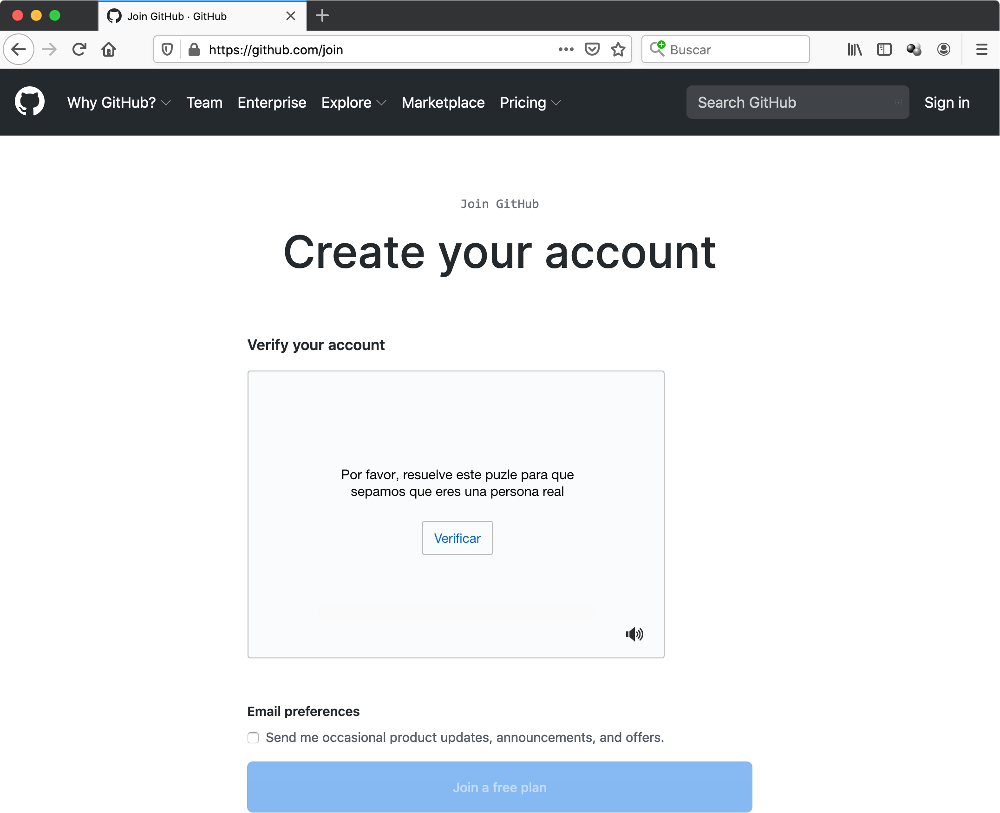
</p>

Al clicar en `Verificar` aparecerá un _acertijo_ gráfico que hay que responder.  Si se acierta, se muestra la confirmación en la misma ventana (ventana de la derecha).


<p align="center">
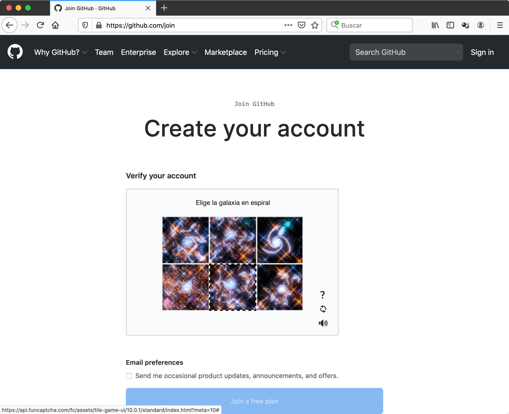 &nbsp; &nbsp;
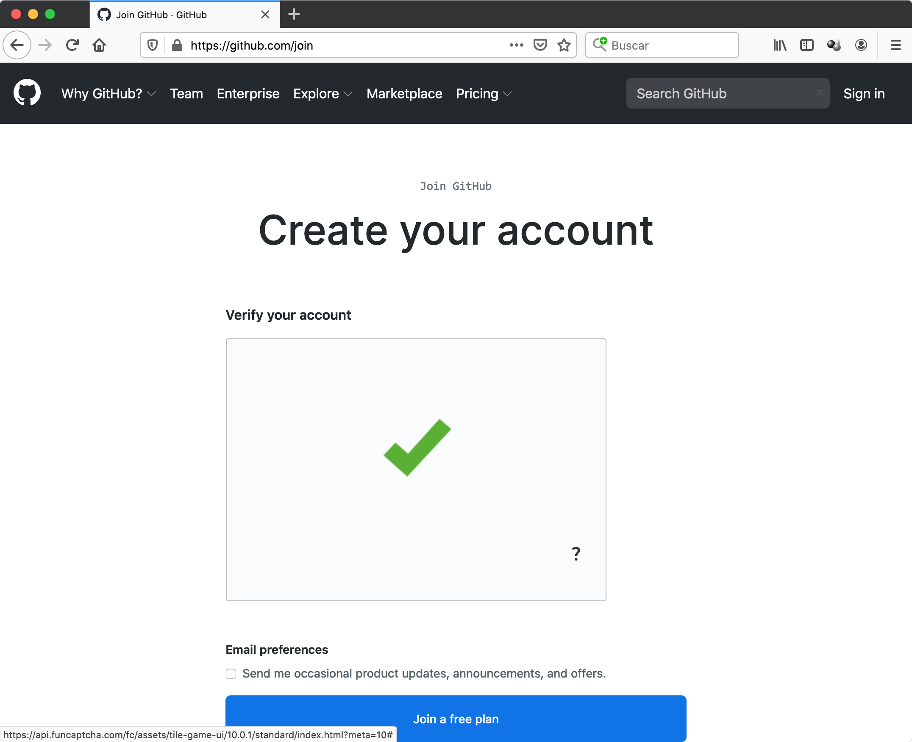
</p>

Clicaremos en el botón `Join a free plan` y pasaremos a la siguiente ventana en la que se nos pregunta por nuestro perfil, tal y como muestra la siguiente ventana,  pasando a continuación a la de la derecha:

<p align="center">
 &nbsp; &nbsp;
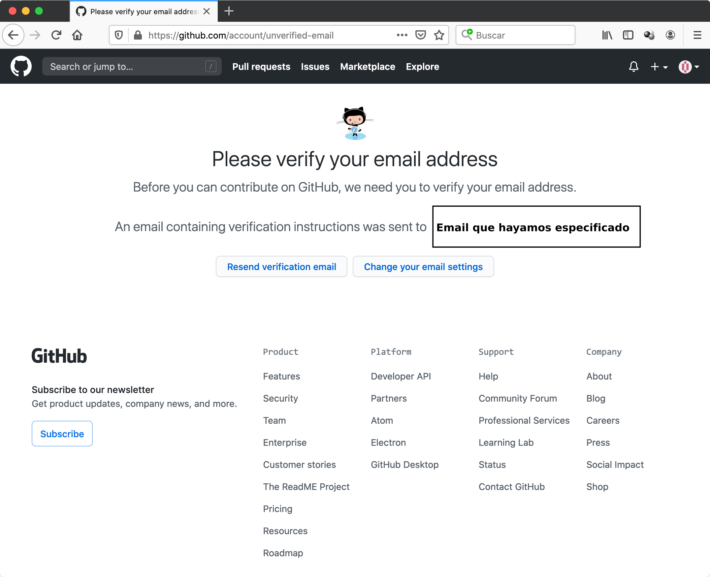
</p>


La cual nos indica que miremos en el email especificado, buscando un correo de confirmación de dirección. Lo buscamos, clicamos en el _link_ de dicho correo donde se nos pide la confirmación y nos aparecerá la siguiente ventana. 
En ella podremos elegir entre algunas de las tres opciones principales, o simplemente saltarlas e ir directamente a nuestra cuenta de usuario de GitHub clicando `Skip this for now`, con lo que aparece definitivamente la ventana de la derecha:


<p align="center">
 &nbsp; &nbsp;

</p>


Llegados a este punto, ya tenemos creado nuestro usuario de GitHub con el que trabajaremos en esta y en las siguientes prácticas.
 Además, esta cuenta la podremos reutilizar en el futuro en otras asignaturas.


## 4.1. Confirmación de usuario de GitHub y compartición de repositorio

Las acciones que se describen en este apartado están relacionadas con la **asignatura** y  más concretamente con este seminario, y no propia o exclusivamente con __GitHub__.

A continuación se va a proceder a asociar vuestro nombre y apellidos con vuestro usuario de GitHub ya que será necesario para nosotros, los profesores, saber qué usuario de __GitHub__ sois cada  uno de vosotros.

Una vez llegados a este punto de la práctica, __y no antes__, y teniendo abierta en el navegador la sesión en __GitHub__ con vuestro usuario, se clicará el enlace proporcionado en un email enviado desde la cuenta de uno de los profesores de la asignatura y con asunto __Identificación usuario GitHub__, con el que cada alumno se auto-identificará clicando su nombre de una lista que aparece en el enlace, tal y como se muestra a continuación (el ejemplo se da para un supuesto usuario de __GitHub__ denominado `Usuario-A` cuyo nombre es Arturo Pérez):

<p align="center">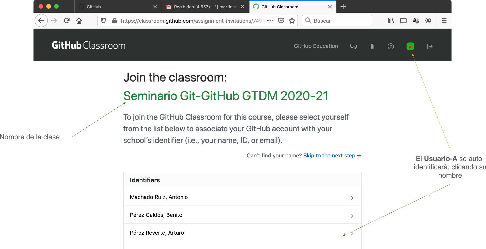</p>


>Se debería ser cuidadoso con el clicado para no elegir un nombre que no sea el que corresponde, ya que esto provocaría ciertos errores tediosos de corregir en el futuro: si esto ocurriera, contáctese con alguno de los profesores para enmendarlo cuanto antes. Si no aparece en la lista, clíquese el enlace `Skip to the next step` y comuníquelo inmediatamente al profesor; esto no impedirá el transcurso normal de la práctica, pero provocará errores de identificación futuros, por lo que habrá que solventarlo también cuanto antes.

A continuación se aceptará la realización de un supuesto ejercicio y de cualquier autorización de acceso por parte de __GitHub Classroom__ (producto de __GitHub__ asociado a entornos académicos, que es el que estaremos utilizando). Es probable que en paralelo se reciba un email de confirmación con un enlace, como el que aparece a continuación a la derecha, aunque probablemente no sea necesario usarlo...

<p align="center">
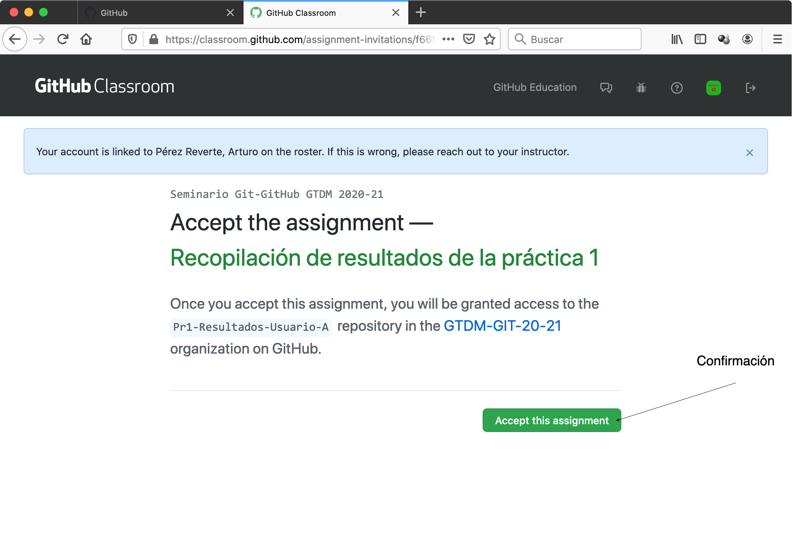
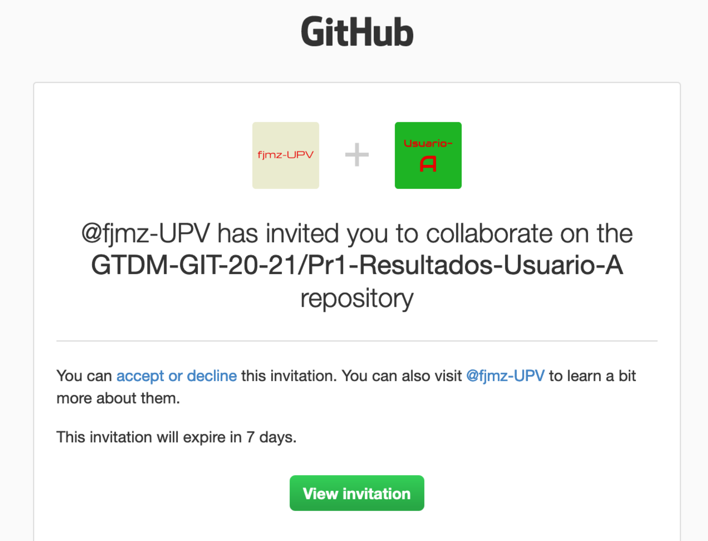
</p>


...ya que desde el propio navegador en el que hemos abierto el enlace original ya tendremos accesible un repositorio con nombre `GIT-GTDM-21-22/Pr1-Resultados-<NOMBRE_DEL_USARIO_DE_GITHUB>` desde el propio sitio web de GitHub en nuestra cuenta de usuario:

<p align="center"></p>


Al aceptar el ejercicio, se crea y se comparte automáticamente un repositorio privado e individual entre cada alumno y una entidad denominada _organización_ con la intención de  ser el _repositorio_ de los resultados de la presente práctica. Esto se ha hecho así para que esta práctica pueda tener un carácter público al principio de la misma  (acceso a repositorio público `Prueba1`), de esta forma no hacía falta ni tener un usuario de __GitHub__ ni pertenecer a la organización `GIT-GTDM-21-22`, y los resultados ya se puedan entregar de forma privada y unipersonal (acceso a repositorio privado `Pr1-Resultados-<NOMBRE_DEL_USARIO_DE_GITHUB>`).

>Este documento en formato Markdown que se está leyendo en este momento, puede que se esté visualizando en un navegador accediendo al repositorio público `https://github.com/GIT-GTDM-21-22/Practica1`.


### 4.1.1. Autenticación: usuario y contraseña/<i>personal access token</i>

A continuación se procederá a clonar el respositorio (esta vez privado e individual) donde cada alumno  dejará los resultados, pero antes hay que tener en cuenta algunos aspectos relativos a la autenticación de usuarios.  La política de autenticación de __GitHub__ va evolucionando y muy probablemente ya no se acepte fuera del navegador la combinación usuario de __GitHub__-contraseña como mecanismo de autenticación. En línea de comandos, la primera vez que se acceda a un repositorio _privado_, __Git__ nos pedirá el nombre de usuario y un _autenticador de acceso personal_ (_personal access token_). Este _token_ puede  caducar, luego probablemente haya que regenerarlo con cierta frecuencia. Un _token_ es una secuencia de caracteres que se utilizan como una especie de contraseña efímera. A continuación vamos a mostrar cómo obtener dicho _token_.

Primeramente, dentro la página correspondiente a nuestra cuenta de __GitHub__ se debe acceder a la opción `Settings` de la cuenta, tal y como se indica a continuación:


<p align="center">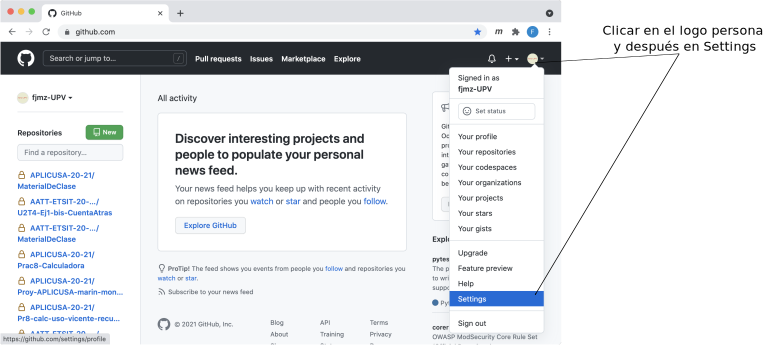</p>

Tras lo cual, en la siguiente ventana hay que clicar `Developper Settings`:

<p align="center">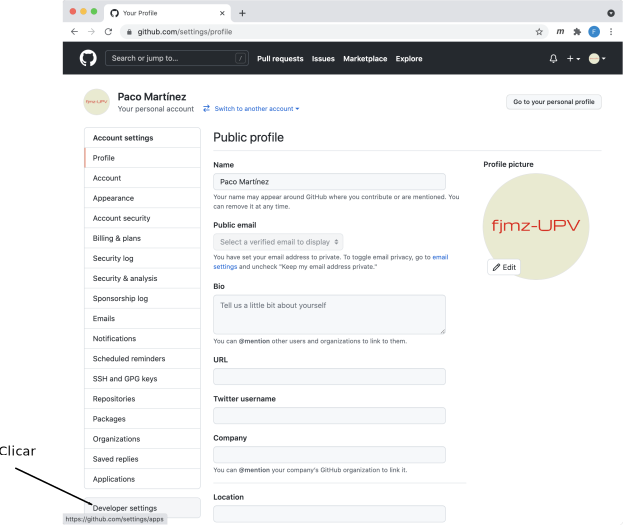</p>

Y en la siguiente ventana, hay que clicar `Personal access tokens`:

<p align="center">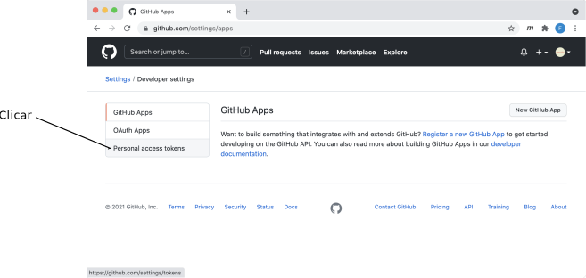</p>

Y generar un nuevo autenticador (en la siguiente figura se puede observar una lista de tokens ya generados para otros contextos):

<p align="center">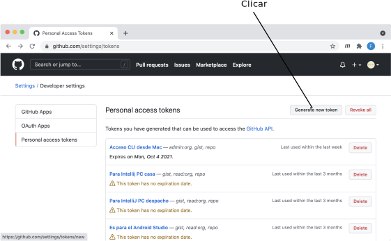</p>

Ahora puede pedirnos nuestra contraseña de __GitHub__ para realizar la generación del _token_ y después, en la siguiente página, debemos introducir un pequeño comentario (lo más apropiado es indicar para qué queremos ese token &#8212;en nuestro caso podemos poner para "Acceso a GitHub desde CLI"&#8212;) y luego indicar qué tipo de permisos son necesarios (en nuestro caso hemos clicado `admin:org`, `gist`  y `repo`; probablemente en un caso sencillo no serán necesarios tantos permisos).

<p align="center">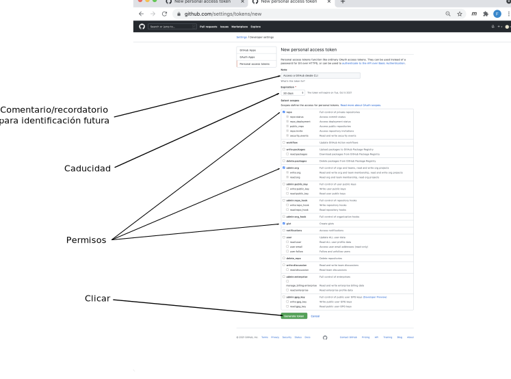</p>


Tras clicar en el botón `Generate token`, el autenticador o _token_ puede obtenerse copiándolo en el portapapeles y después pegándolo allá donde se requiera.

<p align="center">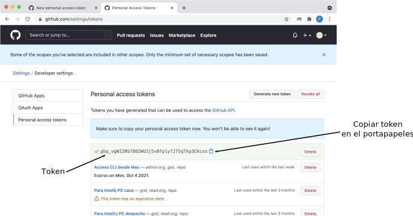</p>


### 4.1.2. Clonación

A continuación clónese en local de la siguiente manera:

```bash
<USUARIO>@<MAQUINA>:~$ cd ~/Desktop/TS1-GTDM

<USUARIO>@<MAQUINA>:~/Desktop/TS1-GTDM$ git clone https://github.com/GIT-GTDM-21-22/Pr1-Resultados-<NOMBRE_DEL_USARIO_DE_GITHUB>
```

>__Solo la primera vez__ que se acceda desde el CLI de nuestro ordenador mediante nuestra cuenta de __GitHub__ para esta operación de clonación de un repositorio _privado_, se requerirá la autenticación (muy probablemente será necesario utilizar el nombre del usuario de GitHub y el token generado &#8212;insistimos en que esta operativa ha ido cambiando con el tiempo y es probable que en el momento de realizar esta práctica sea así&#8212;). Los siguientes accesos al repositorio ya no requerirán de esta autenticación (a no ser que el token haya caducado o bien queramos cambiar de usuario de GitHub).

>Esta autenticación es completamente independiente de la que se hace en el navegador cuando se accede al sitio web de __GitHub__, requiriendo en este caso simplemente el nombre de usuario de __GitHub__ y la contraseña.

>En el caso de querer cambiar de usuario y por lo tanto la autenticación, deberán eliminarse las credenciales de autenticación para que las vuelva a pedir. 


Al no especificar `<DIRECTORIO>` en el comando `git clone` entonces automáticamente se crea uno con el mismo nombre que el repositorio (`Pr1-Resultados-<NOMBRE_DEL_USARIO_DE_GITHUB>`) y ahí se vuelca todo el repositorio y directorio de trabajo, tal y como se podrá observar. 

El contenido del directorio debería ser un fichero denominado `README.md`(fichero Markdown que se visualiza al abrir el repositorio remoto de GitHub en un navegador)  y un directorio `figuras`. Verifíquese en el navegador que el contenido es el mismo que el que aparece en la URL `https://github.com/GIT-GTDM-21-22/Pr1-Resultados-<NOMBRE_DEL_USARIO_DE_GITHUB>` (el contenido de esta URL de GitHub se puede  visualizar porque __ya__ se tienen los permisos oportunos tras la autenticación. Se propone intentar visualizar en el navegador la URL de un repositorio con un `<NOMBRE_DE_USUARIO_DE_GITHUB>` correspondiente al de algún compañero, para observar que el acceso en tal caso no está permitido). 


Como habrá podido apreciar el alumno, acaba de descargarse el repositorio _privado_ `Pr1-Resultados-<NOMBRE_DEL_USARIO_DE_GITHUB>` cuya intención es utilizarlo para guardar los resultados de los ejercicios propuestos en la presente memoria. Tiene una importante diferencia respecto al repositorio `Practica1` y es que el alumno se habrá percatado de que ha hecho falta autenticarse frente a GitHub para poder descargarlo, cosa que no ocurrió con el repositorio público `Practica1`. El motivo es que el repositorio `Pr1-Resultados-<NOMBRE_DEL_USARIO_DE_GITHUB>` es privado (y en este caso, compartido) y solo puede tener acceso el profesor de la asignatura y el alumno en cuestión.


# 5. Resultados a entregar

Tómese nota de todos los comandos que se han ido ejecutando, su funcionalidad, detalles, comentarios y respóndase a las cuestiones que han ido apareciendo a lo largo de la presente práctica en el fichero `Ejercicios.txt`.

Cópiese del directorio `Practica1` el fichero `Ejercicios.txt` y el directorio `dir1` en el directorio `Pr1-Resultados-<NOMBRE_DEL_USARIO_DE_GITHUB>`
(hágase gráficamente, simplemente copiando, no moviendo, los fichero de la ventana origen a la destino):

```
(Antes de la copia)
~
└── Desktop
    └── TS1-GTDM
        ├── Practica1
        │   ├── Ejercicios.txt 
        │   ├── dir1
        │   │   ├── dir2
        │   │   │   └── ...
        │   │   └── ...
        │   ├── repo1
        │   │   └── .git
        │   ├── repo2            
        │   │   └── .git        
        │   └── Prueba1
        │       └── ...        
        └── Pr1-Resultados-<NOMBRE_DEL_USARIO_DE_GITHUB>
            ├── .git
            └── README.md
```

```
(Después de la copia)
~
└── Desktop
    └── TS1-GTDM
        ├── Practica1
        │   ├── Ejercicios.txt 
        │   ├── dir1
        │   │   ├── dir2
        │   │   │   └── ...
        │   │   └── ...
        │   ├── repo1
        │   │   └── .git
        │   ├── repo2            
        │   │   └── .git        
        │   └── Prueba1
        │       └── ...        
        └── Pr1-Resultados-<NOMBRE_DEL_USARIO_DE_GITHUB>
            ├── .git
            ├── README.md            
            ├── Ejercicios.txt 
            └── dir1
                ├── dir2
                │   └── ...
                └── ...
                        
```


## 5.1. Actualización de los repositorios local y remoto

En las siguientes prácticas se explicará el funcionamiento de los comandos más relevantes de __Git__. En este momento, se sugiere que, aunque no se entiendan las acciones descritas a continuación, se ejecuten los siguientes comandos para salvaguardar 
el contenido actualizado del **directorio de trabajo** `~/Desktop/TS1-GTDM/Pr1-Resultados-<NOMBRE_DEL_USARIO_DE_GITHUB>` en su propio **repositorio local**, para después trasladar el nuevo estado del respositorio local al **repositorio remoto** de GitHub  del que procede (`https://github.com/GIT-GTDM-21-22/Pr1-Resultados-<NOMBRE_DEL_USARIO_DE_GITHUB>`).

Ubíquese en el directorio `Pr1-Resultados-<NOMBRE_DEL_USARIO_DE_GITHUB>` y ejecútense allí los comandos __Git__:

```bash
# Vamos al directorio "Pr1-Resultados-<NOMBRE_DEL_USARIO_DE_GITHUB>"
<USUARIO>@<MAQUINA>:~$ cd ~/Desktop/TS1-GTDM/Pr1-Resultados-<NOMBRE_DEL_USARIO_DE_GITHUB>

# Llevamos todos los ficheros del directorio de trabajo al "index"
<USUARIO>@<MAQUINA>:~/Desktop/TS1-GTDM/Pr1-Resultados-<NOMBRE_DEL_USARIO_DE_GITHUB>$ git add -A

# Del index a un commit del repositorio
<USUARIO>@<MAQUINA>:~/Desktop/TS1-GTDM/Pr1-Resultados-<NOMBRE_DEL_USARIO_DE_GITHUB>$ git commit -m "Carga de resultados de la Práctica 1"

# Subida a remoto GitHub
<USUARIO>@<MAQUINA>:~/Desktop/TS1-GTDM/Pr1-Resultados-<NOMBRE_DEL_USARIO_DE_GITHUB>$ git push origin master  # no sería necesario añadir los parametros origin y master, ya que tras la clonación, la rama master lo es con seguimiento
```

Con estas operaciones (que serán detalladas y explicadas en la siguiente práctica), subiremos todos los ficheros y directorios creados en la presente práctica al repositorio remoto preparado para recoger los resultados y allí quedarán almacenados definitivamente para su evaluación.


Por último:

---

__Verifíquese__ abriendo en el navegador la URL `https://github.com/GIT-GTDM-21-22/Pr1-Resultados-<NOMBRE_DEL_USARIO_DE_GITHUB>` (repositorio privado remoto ubicado en __GitHub__) que efectivamente el contenido  está actualizado con el fichero `Ejercicios.txt` y el directorio `dir1`, copiados en el directorio de trabajo.

---


Síganse todas estas indicaciones con la máxima fidelidad, para evitar obtener unos resultados incorrectos y por tanto una merma en la calificación.

## 5.2. Credenciales de Windows y _Sign out_ de <b>GitHub</b>

Al finalizar la sesión de prácticas, solo si la máquina en la que se ha realizado la práctica es una máquina del laboratorio y por tanto y en principio con sistema operativo Windows, recuérdese tomar la precaución de borrar las credenciales de __GitHub__ en el _Administrador de credenciales_ de Windows. Para acceder a él se puede escribir `credenciales` en el _buscador_ de Windows y después acceder a las _credenciales de Windows_; allí encontraremos algunas referenidas a `github.com` que deberemos eliminar, olvidando entonces el sistema el nexo con la cuenta de __GitHub__ utilizada hasta el momento, tal y como se muestra en la figura

<p align="center">
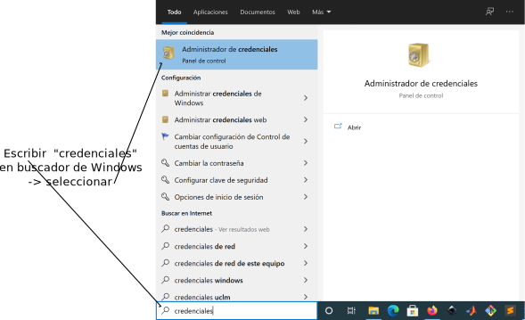
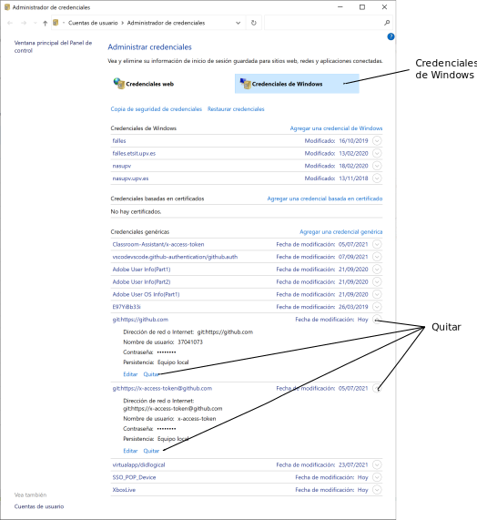
</p>

El alumno debe ser consciente de que esto __no__ elimina la autenticación del navegador, solo la de línea de comandos ya que son autenticaciones independientes. Para eliminar la autenticación del navegador se debe cerrar la sesión de __GitHub__ con la acción de _Sign out_ , seleccionándola desde el logo de usuario en la esquina superior derecha tal y como muestra la siguiente figura.

<p align="center">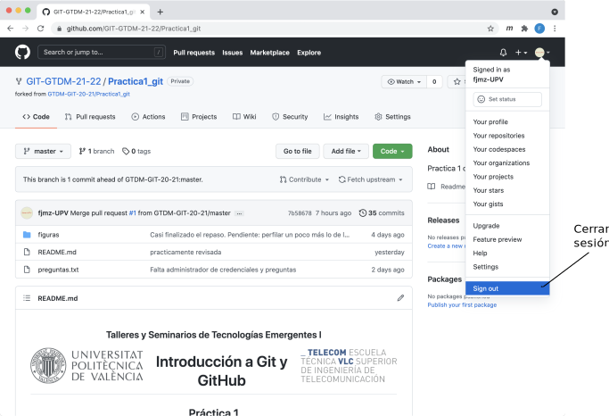</p>


</div>